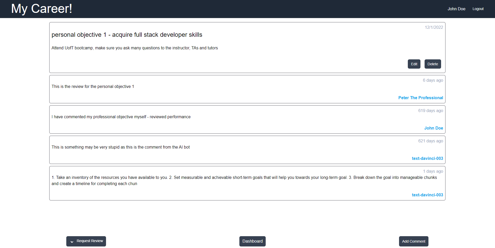

# My Career(r) Life Cycle Management System 

## Description
<br>
Career development reflects an individual's vision, goals, motivation, and approaches to learning. It addresses the possibility of an overall career path as opposed to focusing only on the current job.

The project allows personal development plan lifecycle management. The potential user can document personal development goals being the part of regular review process getting industry professionals feedback, including but not limited to the latest AI technologies to guarantee of staying on top of the world industrial development.

## Collaborators
```
Mohamed Osman, Vasily Likhovarydo, and Michael Frayne. 
```

## Screenshot

<br>

## User Story 📘
```
AS A user, I’d like to be able to get an expert advice for my career objective to understand my development progress.
AS A user, I’d like to be able to add, modify and delete my career objectives. 
THEN I’d like to have an ability to have a professional advisor comments on each of my objectives.
THEN I’d like to have an ability to get the AI comment for my objectives.

```
<br>

## Acceptance Criteria ✅
```
I WANT TO be presented with the login page if I am not logged in
THEN I AM able to login or move to create a new user
WHEN I sign in as a user
  I WANT TO be presented with all my goals
  WHEN I click on a goal
  I WANT TO be presented with the goal information and comments for that goal
  WHEN I click the button to edit the goal
  I WANT TO be presented with the form to edit the goal
  WHEN I click the button to save the goal to the database
  I WANT TO be presented with the goal page with the updated goal
  WHEN I click the button to delete a comment
  I WANT TO be presented with the goal page with the updated comments
  WHEN I click the button to request review
  I WANT TO be presented with a dropdown of advisors or ai
  WHEN I click an option
  THEN the button to request review dissapears and displays Cancel Review button
  WHEN I click the button to delete the goal
  I WANT TO return to the dashboard
WHEN I sign in as an advisor
  I WANT TO be presented with all the goals that are assigned to me for review
  WHEN I click on a goal
  I WANT TO be presented with the goal information and comments for that goal
  WHEN I click the button to create a new comment
  I WANT TO be presented with the form to create a new comment
  WHEN I click the button to add the comment to the database
  I WANT TO be presented with the created comment below the goal
  WHEN I click the button to edit the comment
  I WANT TO be presented with the form to edit a comment
  WHEN I click the button to save the comment to the database
  I WANT TO be presented with the edited comment updated
  WHEN I click the button to delete a comment
  I WANT TO be presented with the updated comments
  ```
<br>

## Deployment Link 🔗
[Deployment link](https://my-career.herokuapp.com/)<br>
[Repo link](https://github.com/vasilyl1/team-project)<br>

## API's
[OpenAI API](https://openai.com/product#made-for-developers )<br>
[Google API](https://developers.google.com/custom-search/v1/introduction)<br>


## Licence 🔑

MIT License

Copyright (c) [2023]

Permission is hereby granted, free of charge, to any person obtaining a copy
of this software and associated documentation files (the "Software"), to deal
in the Software without restriction, including without limitation the rights
to use, copy, modify, merge, publish, distribute, sublicense, and/or sell
copies of the Software, and to permit persons to whom the Software is
furnished to do so, subject to the following conditions:

The above copyright notice and this permission notice shall be included in all
copies or substantial portions of the Software.

THE SOFTWARE IS PROVIDED "AS IS", WITHOUT WARRANTY OF ANY KIND, EXPRESS OR
IMPLIED, INCLUDING BUT NOT LIMITED TO THE WARRANTIES OF MERCHANTABILITY,
FITNESS FOR A PARTICULAR PURPOSE AND NONINFRINGEMENT. IN NO EVENT SHALL THE
AUTHORS OR COPYRIGHT HOLDERS BE LIABLE FOR ANY CLAIM, DAMAGES OR OTHER
LIABILITY, WHETHER IN AN ACTION OF CONTRACT, TORT OR OTHERWISE, ARISING FROM,
OUT OF OR IN CONNECTION WITH THE SOFTWARE OR THE USE OR OTHER DEALINGS IN THE
SOFTWARE.